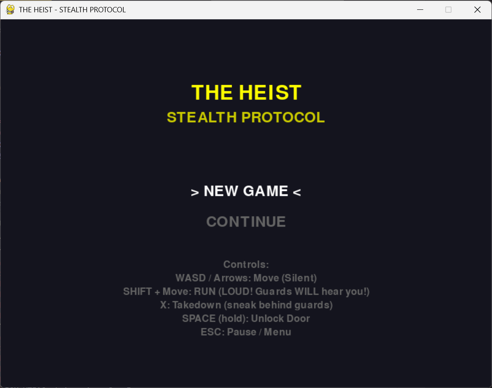
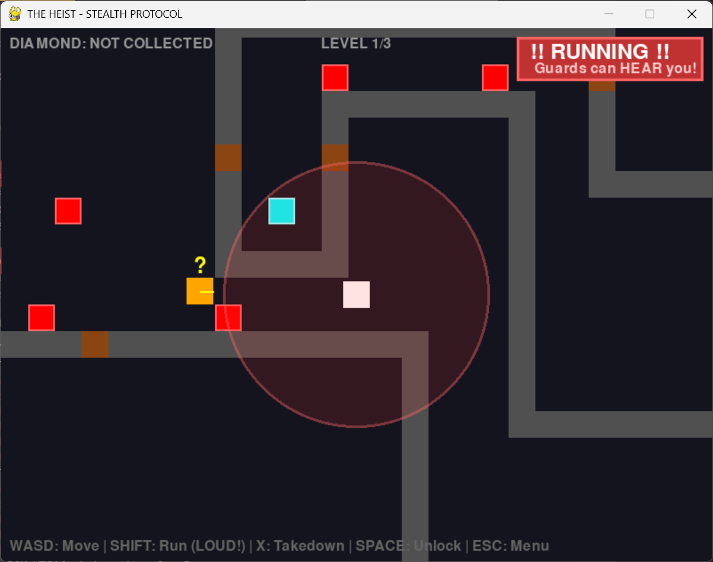
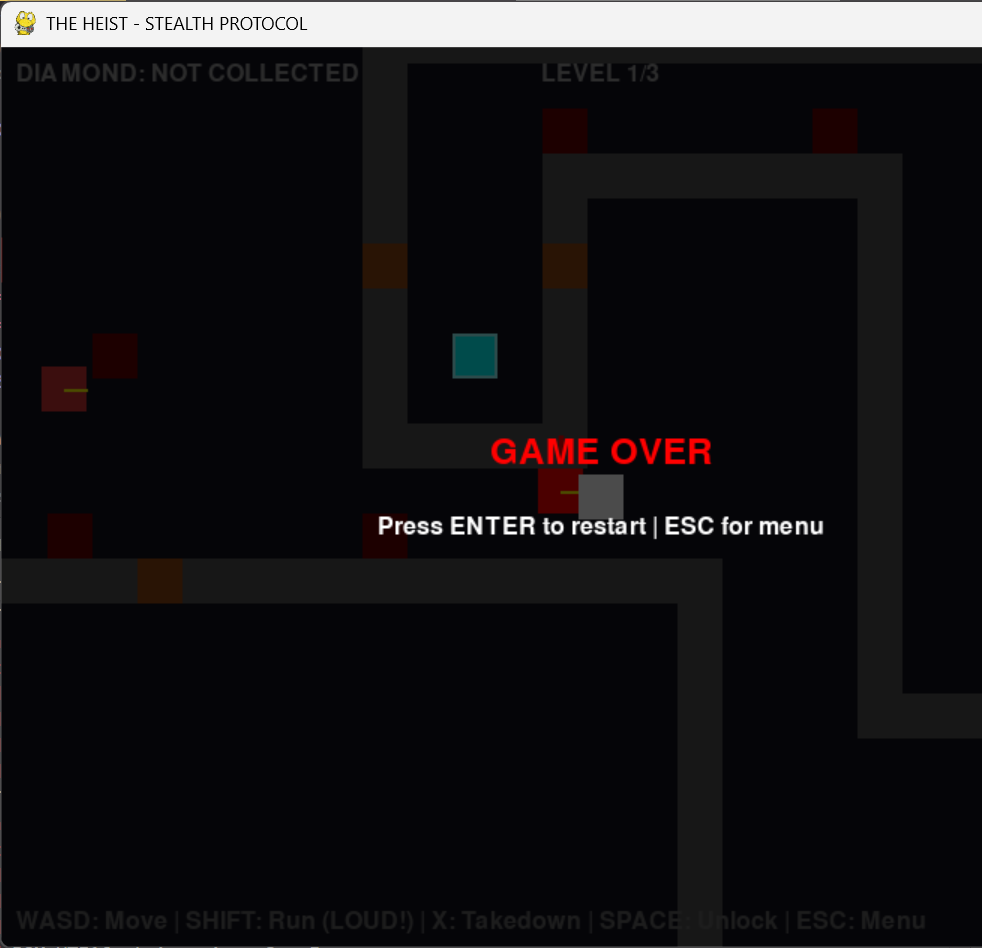

# The Heist — Minimalist Stealth Game

A 2D stealth puzzle game built with Python and Pygame, created by an Agent AI.

## Overview

The Heist is a minimalist stealth experience that pits patience against risk. Exploit flaws in security systems, avoid detection by intelligent guards, and execute the ultimate robbery. Navigate through increasingly complex levels using silent movement, strategic takedowns, and careful timing.

## Features

- **Stealth-based gameplay** with vision cones and noise detection
- **Intelligent guard AI** with patrol, suspicious, and chase states
- **BFS pathfinding** for realistic guard pursuit
- **Corner assist mechanics** for smooth wall navigation
- **Environmental hazards:** lasers, locked doors
- **3 campaign levels** with progressive difficulty
- **Save/load system** for persistent progress
- **Full sound design** with ambient music and event SFX
- **Star Wars-style intro** with scrolling text

## Controls

| Key | Action |
|-----|--------|
| `WASD` / `Arrows` | Move silently |
| `Shift` + Move | Run (creates noise) |
| `X` | Takedown guard |
| `Space` (hold) | Unlock doors |
| `ESC` | Pause / Menu |
| `R` / `Enter` | Restart level |

## How to Play

1. Install dependencies:
   ```bash
   pip install pygame
   ```

2. Run the game:
   ```bash
   python main.py
   ```

3. **Objective:** Collect the diamond and reach the exit without being caught.

## Game Mechanics

### Guard AI
- **Patrol:** Guards move in random patterns
- **Suspicious (?):** Investigates noise or brief sightings
- **Chase (!):** Actively pursues player using pathfinding

### Detection Systems
- **Vision cone:** 200px range, 60° field of view, blocked by walls
- **Hearing:** Guards detect running within 120px radius
- **Running noise:** Creates a 150px detection sphere

### Hazards
- **Lasers:** Cycle on/off every 1.5 seconds
- **Locked doors:** Hold `Space` for 2 seconds to unlock

## Project Structure

```
TheHeist/
├── main.py           # Game loop, menu, intro sequence
├── settings.py       # Constants, level definitions, colors
├── player.py         # Player movement and collision
├── entities.py       # Guard AI, lasers, doors, collectibles
├── level.py          # Level parsing and wall management
├── camera.py         # Viewport and scrolling system
├── validate_levels.py# Level validation utility
└── sounds/           # Audio assets
```

## Screenshots







## Technical Highlights

- State machine pattern for guard behavior
- Line-of-sight raycasting for vision system
- Grid-based BFS pathfinding with performance limits
- Component-based entity architecture
- JSON-based save system

## Edit & Customize

- Modify level layouts in `settings.py` using character notation:
  - `#` Wall | `.` Empty | `P` Player | `G` Guard
  - `D` Diamond | `E` Exit | `L` Laser | `O` Door
- Adjust game constants (speeds, ranges, timers) in `settings.py`
- Add new sound effects to the `sounds/` directory

---

*Built with Python & Pygame*
